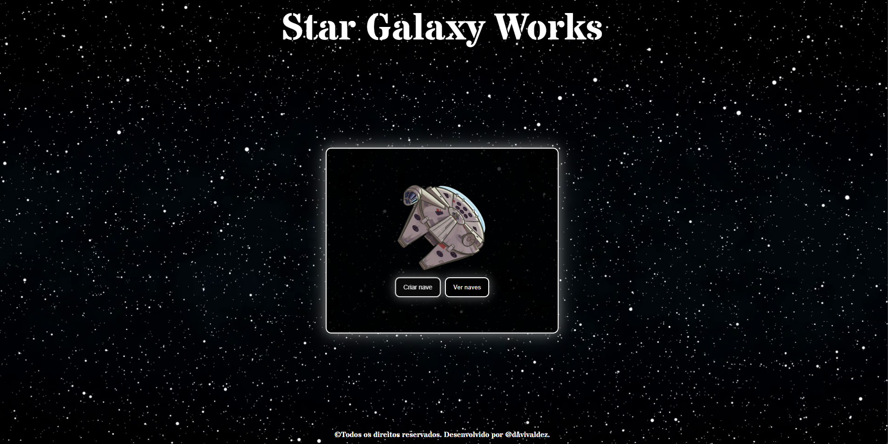
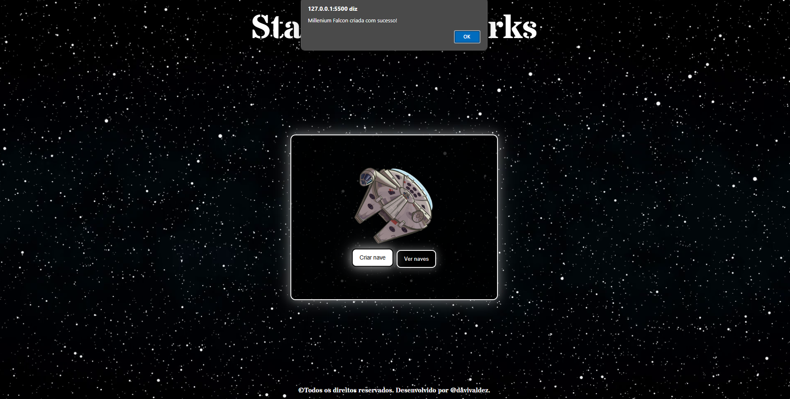
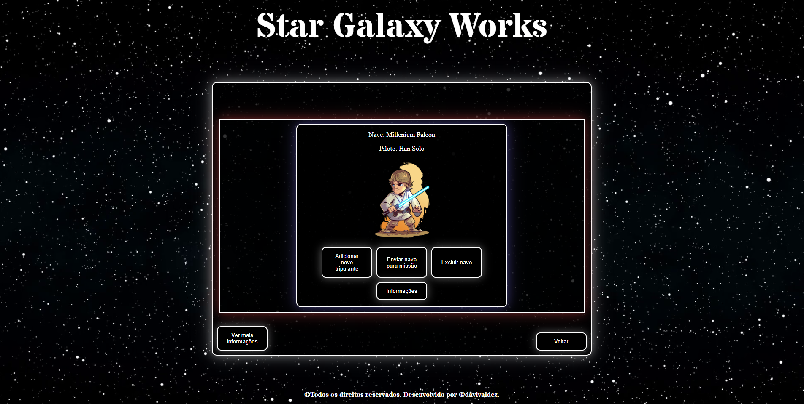
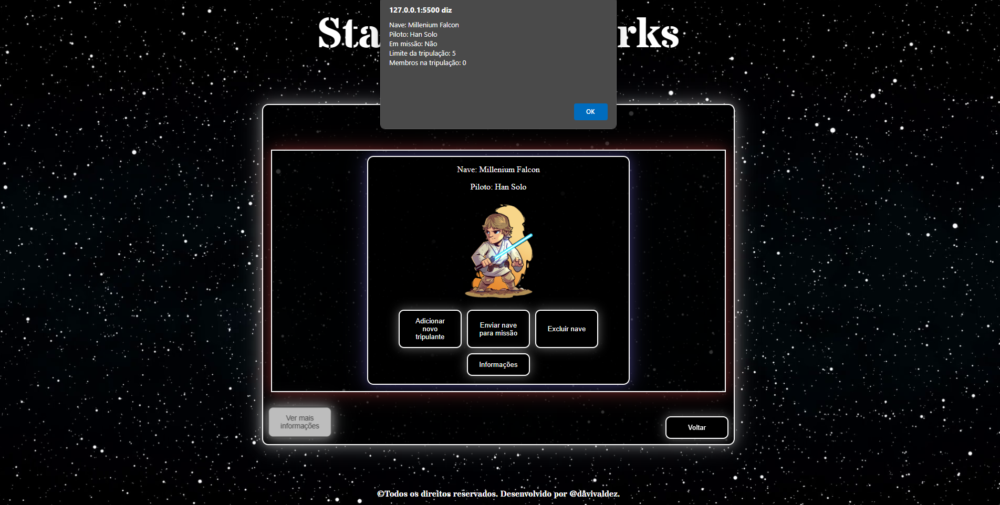
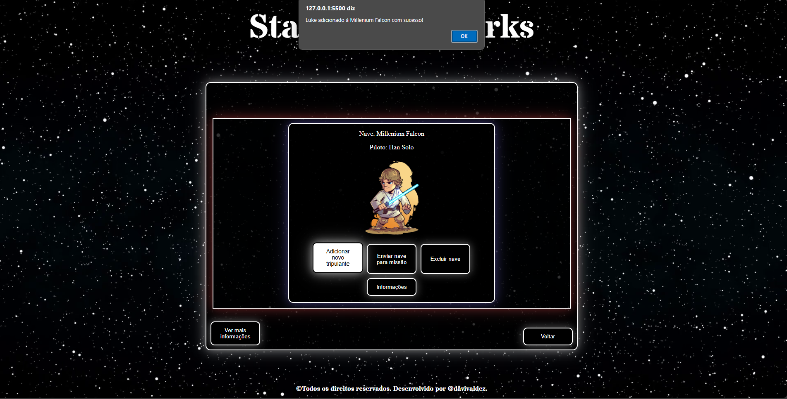
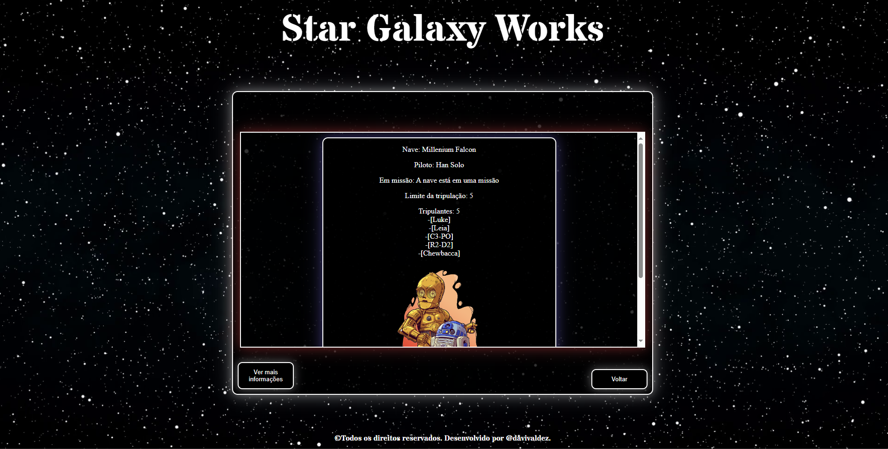

<h1 align="center" style="font-weight: bold;">Star Galaxy Works 🌌</h1>

 <a href="#descrição">Descrição</a> • 
 <a href="#tecnologias-utilizadas">Tecnologias utilizadas</a> • 
 <a href="#instalação">Instalação</a> • 
 <a href="#uso">Uso</a> •
 <a href="#contribuição">Contribuição</a> •
 <a href="#contribuidores">Contribuidores</a> •
 <a href="#licença">Licença</a> 

    

## Descrição

A Star Galaxy Works foi um projeto desenvolvido com o objetivo de criar naves com uma temática de Star Wars, possuindo funcionalidades de adicionar membros à tripulação, enviar naves para missões e visualizar informações adicionais sobre as naves. A finalidade deste projeto foi para praticar o uso de TypeScript, funções assíncronas e requisições.

## Tecnologias utilizadas:

- Node.js.
- TypeScript.
- HTML.
- CSS.

## Instalação

### Pré requisitos

- Node.js

## Uso

### Clonando repositório:

    git clone https://github.com/davivaldez/StarGalaxyWorks.git

### Alterando diretório:

    cd StarGalaxyWorks/

### Instalando dependências do package.json:

    npm install

### Inicializando o build da aplicação:

    npm run build

### Inicializando a aplicação:

    npm run json-server

### Tela Inicial

    

### Criando nova nave

#### Para criar uma nova nave é muito simples! Clique no botão "Criar nave" e preencha o campo do nome da nave, piloto e o limite da tripulação e depois confirme a criação.

    

### Ver naves

#### Para ver as naves registradas, clique no botão "Ver naves" na página principal.

    

### Ver todas as naves registradas

#### Para ver todas as naves registradas, clique no botão "Ver mais informações".

    

### Adicionar um novo membro a tripulação

#### Clique no botão "Adicionar novo tripulante" e forneça o nome do tripulante.

    

### Enviar nave para missão

#### Clique no botão "Enviar nave para missão" e confirme que deseja iniciar uma missão.

    

### Informações adicionais sobre a nave

#### Clique no botão "Informações" da nave que deseja exibir suas informações.

    

### Excluir uma nave

#### Clique no botão "Excluir nave".

    

## Contribuição

Contribuições são bem-vindas! Siga as etapas abaixo para contribuir com o projeto:

1. Faça um **Fork** no repositório.
2. Crie uma **branch** para sua funcionalidade ou correção de bug: `git checkout -b minha-nova-funcionalidade`.
3. Faça um **Commit** para suas mudanças: `git commit -m 'Adicionando nova funcionalidade'`.
4. Faça um **Push** para a branch criada: `git push origin minha-nova-funcionalidade`.
5. Abra um **Pull Request**.

Obrigado por contribuir!

## Contribuidores

Atualmente, este projeto é mantido por um único contribuidor:

<table>
  <tr>
    <td align="center">
      <a href="https://github.com/davivaldez">
         
        

          <b>Davi Valdez</b>
        

      </a>
    </td>
  </tr>
</table>

Embora eu seja o único contribuidor até o momento, este projeto é aberto para contribuições da comunidade. Se você estiver interessado em contribuir, siga as instruções na seção de [Contribuição](#contribuição). Obrigado pelo seu interesse!

## Licença

Este projeto está licenciado sob a [MIT licensed](./LICENSE).
